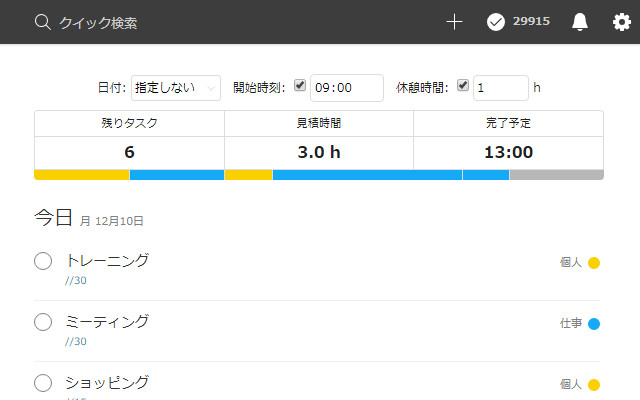
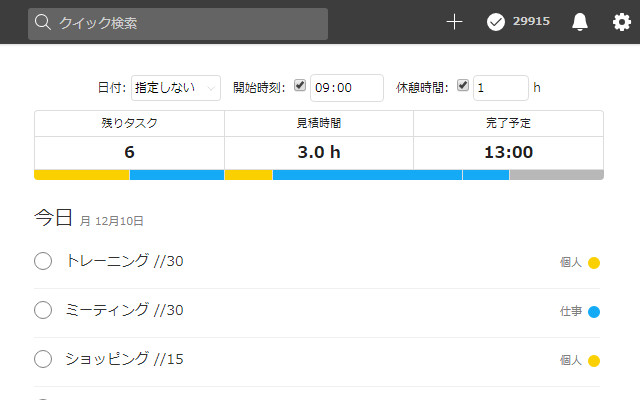
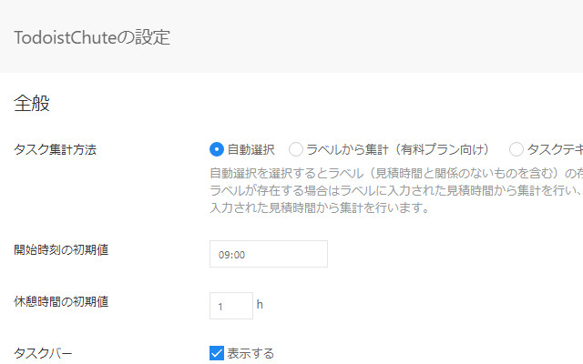

# TodoistChute: Todoistに完了予定時刻を表示

*Read this in other languages: [English](README.md), [日本語](README.ja.md).*

Todoistのタスクに設定した見積時間を集計して完了予定時刻を表示します。

## インストール

Chrome ウェブストアからインストールしてください。

[TodoistChute: Todoistに完了予定時刻を表示 \- Chrome ウェブストア](https://chrome.google.com/webstore/detail/todoistchute-finish-time/ghllkaandaghmnhgldofdmollpjlefmj)

## 特徴

* タスク毎に見積時間を設定すれば完了予定時刻を自動計算して表示
* 日付の絞り込みが可能
* 開始時刻や休憩時間を設定可能

## 使い方

### タスクに見積時間を設定する

タスク毎にラベルまたはテキストに見積時間を設定すると、TodoistChuteはラベルとテキストから自動で見積もり時間を集計します。

#### 方法1. ラベルに設定（Todoist有料プラン向け）

Todoistのタスクに「//分数」のラベルを作成します。

#### 方法2. テキストに設定（Todoist無料プラン向け）

Todoistのタスクのテキスト内に「//分数」と入力します。

### オプション画面で設定変更（お好みで）

[chrome://extensions/](chrome://extensions/)からオプション画面を開いて必要に応じて設定を変更します。

## License

MIT
