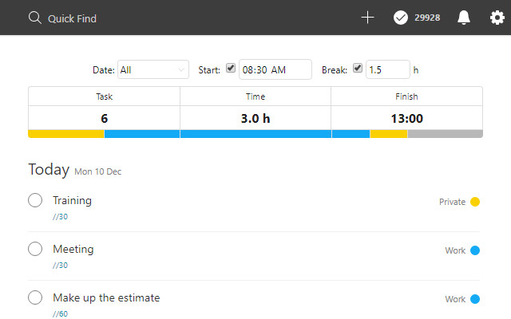
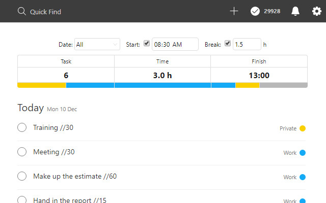
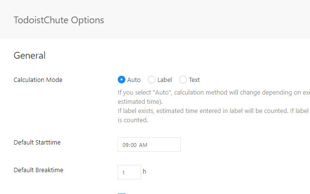

# TodoistChute: Finish Time for Todoist

*Read this in other languages: [English](README.md), [日本語](README.ja.md).*

TodoistChute calculates the estimated time set for every task on Todoist and shows the finish time.

## Installation

Install the extension via Chrome webstore.

[TodoistChute: Finish Time for Todoist \- Chrome Web Store](https://chrome.google.com/webstore/detail/todoistchute-finish-time/ghllkaandaghmnhgldofdmollpjlefmj)

## Features

* By setting the estimated time for each task, the estimated finish time is automatically calculated and displayed.
* You can narrow down the date.
* You can set the start time and the break time.

## How to use

### Enter the estimated time

if you enter the estimated time for label or text of the task, TodoistChute calculates automatically.

#### 1. Label

Enter the estimated time in the task label.

For example, if the estimated time is 90 minutes, enter it in the following format and it will be recognized as 90 minutes.

* `//90`
* `//90m`
* `//90分`
* `//1:30`
* `//1h30m`
* `//1時間30分`
* `//1.5h`
* `//1.5時間`

#### 2. Text

Enter the estimated time in the task text.

The input format is the same as for labels.

### Options

You can change the settings as necessary.

[chrome://extensions/](chrome://extensions/)

## License

MIT
